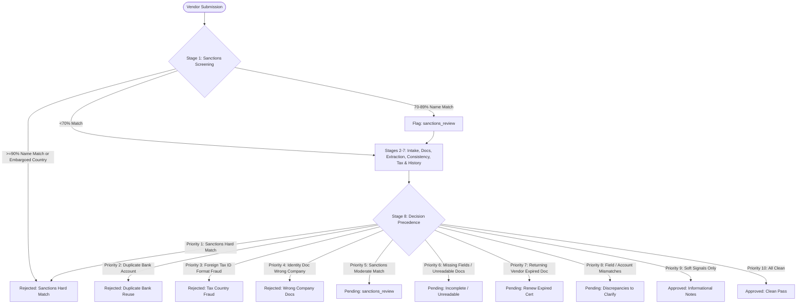

# Intake — Vendor Verification Process

A working, live-runnable process for vendor onboarding (PS-2): a submission comes in, the process validates it, cross-references every document field against the form and against prior submissions, and produces **Approved / Pending / Rejected** with the reasoning attached — and, for anything not approved, a specific message back to the vendor about exactly what's needed.

## Run it (one command)

```bash
cd backend
pip install -r requirements.txt
python3 sample_data/make_pdfs.py
uvicorn app.main:app --reload
```

Open **http://localhost:8000** — that's it. The FastAPI backend serves the frontend directly, so there's no separate dev server to keep alive during a demo.

Optional: set `ANTHROPIC_API_KEY` in your environment to have the vendor follow-up message polished by Claude instead of the built-in template. Not required — the pipeline works identically either way.

## What's actually running

* **Backend**: Python / FastAPI. `app/engine.py` is the rules engine — every check is a small, pure function so each decision is inspectable and testable on its own.
* **Documents**: Real PDFs, parsed with `pypdf` (`app/extraction.py`), not pre-baked JSON pretending to be documents.
* **Storage**: SQLite (`onboarding.db`). Two tables — `runs` (full trace of every submission, backs the Ledger) and `vendor_ledger` (one row per decided vendor, used to catch duplicate bank accounts and recognize returning vendors).
* **Live run view**: The `/api/submissions/stream` and `/api/demo-scenarios/{key}/stream` endpoints are genuine Server-Sent Event streams — each stage is computed for real and pushed to the browser the moment it completes.
* **Frontend**: A single static HTML/CSS/JS file (`frontend/index.html`), no build step.

## Try it without typing anything

The **Submit** page has one-click scenario buttons covering the happy path, edge cases, and seed runs needed to set up history for the duplicate-account and returning-vendor cases.

Run `seed_vantage` before `edge_duplicate_bank_account`, and `seed_anchor` before `edge_returning_vendor_expired_doc`.

You can also fill out the manual form and attach your own PDFs. The sample PDFs in `backend/sample_data/docs/` are good starting points for constructing a new scenario.

## The pipeline (8 stages, in order)

1. **Sanctions & restricted-party screening** — screens company name, trading name, contact name, and country against restricted entity lists and embargoed jurisdictions before any other checks execute. Statutory compliance requirement.

2. **Intake & schema validation** — required fields present, email/phone well-formed.

3. **Document validation** — all three PDFs present and machine-readable.

4. **Field extraction** — pulls company name, registration number, tax ID, country, account holder, account number, bank name, and SWIFT/BIC out of the actual PDF text.

5. **Cross-document consistency check** — every field extracted from every document is compared against what was typed on the form, not just company names.

6. **Tax ID & bank country consistency** — checks whether the tax ID format actually matches the declared country using known formats.

7. **Risk & vendor history check** — duplicate bank account reuse under a different name, returning-vendor recognition, and soft signals such as a personal email domain.

8. **Decision priority & risk synthesis** — synthesizes all stage findings into one final verdict according to the strict priority order.

## Stage 5 in detail — what gets cross-checked, and how

| Document          | Field                    | Compared to                    | Match type             |
| ----------------- | ------------------------ | ------------------------------ | ---------------------- |
| Registration cert | Company name             | Submitted legal name           | Fuzzy                  |
| Registration cert | Registration number      | Submitted registration number  | Exact                  |
| Registration cert | Country of incorporation | Submitted country              | Alias-normalized exact |
| Tax cert          | Company name             | Submitted legal name           | Fuzzy                  |
| Tax cert          | Tax ID                   | Submitted tax ID               | Exact                  |
| Tax cert          | Country                  | Submitted country              | Alias-normalized exact |
| Bank letter       | Account holder name      | Submitted name or trading name | Fuzzy                  |
| Bank letter       | Account number           | Submitted bank account number  | Exact                  |
| Bank letter       | Bank name                | Submitted bank name            | Fuzzy                  |
| Bank letter       | SWIFT/BIC                | Submitted SWIFT/BIC            | Exact                  |

Two deliberately different comparison strategies:

* **Exact identifiers** — registration number, tax ID, account number, and SWIFT/BIC are normalized by stripping spaces/dashes and uppercasing, then required to match exactly.
* **Names and countries** — use fuzzy matching or alias normalization because legitimate variations can exist.

Severity is **not uniform** across this stage. A document issued to the wrong company is treated differently from a typo in an account number.

## The edge cases, and why they're not trivial

The interesting part of this problem isn't detecting that something is inconsistent — it's deciding **how severely to treat each kind of inconsistency**.

| Scenario                           | What's unusual                                                  | Verdict                                 | Why                                                                                                                          |
| ---------------------------------- | --------------------------------------------------------------- | --------------------------------------- | ---------------------------------------------------------------------------------------------------------------------------- |
| **Talon Sentinel Trading Co**      | Exact match to restricted entity list                           | **Rejected**, statutory override        | A hard restricted-party match is a statutory legal stop. It overrides all other pipeline checks and escalates to compliance. |
| **Talon Sentinal Trading Company** | ~81% fuzzy similarity to restricted party                       | **Pending** (`sanctions_review`)        | Moderate match requires human compliance review. Vendor communication remains generic and avoids accusations.                |
| **Bluewave (Freedonia)**           | Declared country is an embargoed jurisdiction                   | **Rejected**, statutory override        | Statutory trade restriction. Complete legal stop overriding otherwise clean document checks.                                 |
| **Bluewave with Meridian's certs** | Registration and tax certificates belong to a different company | **Rejected**                            | Wrong-entity documents are treated as a hard stop.                                                                           |
| **Bluewave, account number typo**  | Form account number doesn't match its own bank letter           | **Pending**                             | A single transposed digit can be an honest typo, so the vendor is asked to confirm.                                          |
| **Nimbus Retail**                  | Bank account is held by the parent company                      | **Pending**                             | A name mismatch can have legitimate explanations such as subsidiaries or holding companies.                                  |
| **Meridian Traders**               | US company has a tax ID shaped like a UK VAT number             | **Rejected**                            | A positive country/tax-ID inconsistency is treated as a fabrication signal.                                                  |
| **Sterling Freight Partners**      | Uses a bank account already registered to another company       | **Rejected**, overrides everything else | Duplicate payout-account reuse is treated as a disqualifying payment-redirection fraud signal.                               |
| **Anchor Supplies (renewal)**      | Previously approved vendor has one expired tax certificate      | **Pending**, lightweight                | The system recognizes the returning vendor and requests only the missing/expired document.                                   |

The decision priority is implemented explicitly in `app/engine.py`.

## Decision priority, in full

1. **Sanctions hard match** (name ≥ 90% or embargoed country) → **Rejected**.
2. **Duplicate bank account reuse** under a different company name → **Rejected**.
3. **Tax ID format provably matches a different country** than declared → **Rejected**.
4. **Registration or tax certificate issued to a different company** → **Rejected**.
5. **Sanctions moderate match** (70–89%) → **Pending** (`sanctions_review`).
6. **Missing required fields or unreadable documents** → **Pending**.
7. **Returning vendor with only one expired document** → **Pending**, lightweight.
8. **Other name or field mismatch** → **Pending**, with a specific clarification request.
9. **Only soft signals remain** → **Approved**, with the signals noted.
10. **Nothing flagged** → **Approved**.

## Decision Workflow Diagram



## Assumptions

* Three documents are required for a complete submission: registration certificate, tax certificate, and bank confirmation letter.
* Tax ID format validation covers US, UK, Germany, India, Singapore, and UAE as representative examples.
* Country comparisons normalize common aliases such as USA/U.S./America and UK/U.K./Great Britain.
* Duplicate bank account and other exact-identifier checks strip spaces and dashes and uppercase values before comparison.
* A vendor-provided `relationship_note` provides context to a human reviewer for rapid triage when a moderate bank-holder name mismatch occurs, but does not auto-approve the mismatch.

## AI usage

The rules engine is deterministic on purpose. Every check is based on a regex, similarity score, or database lookup so the reason for any verdict can be explained.

The optional LLM usage is limited to polishing the vendor-facing message in `app/messaging.py`. The rules engine decides **what** to say, while Claude is only used to make the wording friendlier when an API key is available. A plain-template fallback ensures the demo continues working without the API.

## Project structure

```text
backend/
  app/
    main.py          FastAPI app, SSE streaming endpoints, dashboard API
    engine.py        Pipeline orchestrator + decision synthesis
    rules.py         Name matching, ID/country normalization, tax ID formats, email checks
    extraction.py    PDF text extraction + field parsing
    messaging.py     Vendor message generation
    models.py        Pydantic schemas
    db.py            SQLite persistence

  sample_data/
    make_pdfs.py     Generates all sample PDF documents
    scenarios.py     Defines the demo scenarios
    run_scenarios.py Regression test: runs all scenarios, checks verdicts

frontend/
  index.html         Submit / Live Run / Ledger — single file, no build step
```

## Regression check

```bash
cd backend
python3 sample_data/run_scenarios.py
```

Runs all scenarios directly against the engine (no server needed) and prints PASS/FAIL against the expected verdict for each scenario.
