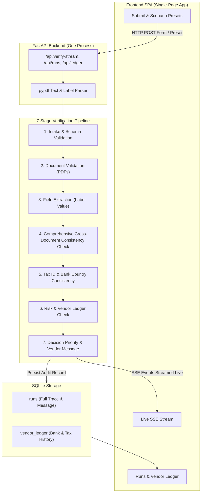

# Automated Vendor Onboarding Verification Process

A production-grade, automated Vendor Onboarding Verification system built with **FastAPI**, **real PDF parsing (`pypdf`)**, **SQLite** ledger and trace storage, real-time **Server-Sent Events (SSE)** streaming, and an intuitive Single-Page Application (SPA).

---

## The Problem Solved

Before paying a vendor, procurement teams must verify legitimacy, tax compliance, and banking integrity across multiple jurisdictions. Manual review is slow, error-prone, and vulnerable to fraud (e.g. payment redirection, fake tax IDs, and mismatched paperwork).

This automated engine takes vendor submissions (form fields + 3 machine-readable PDFs: **Registration Certificate**, **Tax Certificate**, **Bank Letter**), executes a deterministic 7-stage verification pipeline, and produces an explicit verdict: **Approved**, **Pending**, or **Rejected**, with clear decision reasoning and tailored vendor communications.

---

## System Architecture & Pipeline



---

## The 7 Verification Stages (Exact Execution Order)

1. **Intake & Schema Validation**: Ensures all required fields are present and emails/phones are well-formed.
2. **Document Validation**: Verifies all 3 PDFs are present and contain extractable text.
3. **Field Extraction from Documents**: Transparent, regex-based `Label: Value` parser extracting company names, tax IDs, registration numbers, valid/expiry dates, bank names, account numbers, and SWIFT/BIC codes.
4. **Comprehensive Cross-Document Consistency Check**:
   - Compares **EVERY** field between form and documents:
     - **Exact Identifiers** (`registration_number`, `tax_id`, `bank_account_number`, `swift_bic`): Strict normalized exact matching (strips spaces/dashes).
     - **Country Fields**: Normalized alias matching ("USA" $\rightarrow$ "united states", "UK" $\rightarrow$ "united kingdom").
     - **Company Names**: Fuzzy similarity with legal corporate suffixes (`Ltd`, `LLC`, `Inc`, `GmbH`, `Pvt Ltd`, etc.) stripped.
       - Registration / Tax cert name mismatch $< 55\%$ $\rightarrow$ **Critical Inconsistency (Rejected)**.
       - Registration / Tax cert name variation $55-85\%$ $\rightarrow$ **Pending**.
       - Bank account holder mismatch $\rightarrow$ **Pending** (cleared if `relationship_note` provided, never auto-rejects).
     - **Bank Name**: Fuzzy similarity.
   - For every discrepancy, the vendor message explicitly quotes **both the value on the form and the value on the document**.
5. **Tax ID & Bank Country Consistency**: Country-specific format validation (US EIN, UK VAT, Germany VAT, India GSTIN, Singapore UEN, UAE TRN). If a tax ID fails the declared country but matches a different country (e.g., US entity with UK VAT `GB998877665`), it is flagged as a **hard inconsistency / fraud signal (Rejected)**.
6. **Risk & Vendor History Check**: Queries historical `vendor_ledger` to detect **duplicate bank account reuse** under different company names (critical fraud override), recognizes returning approved vendors, and checks certificate expiration.
7. **Decision Priority & Vendor Message**: Synthesizes all findings using a deterministic, explicit priority tree and generates a warm, direct, actionable vendor-facing message for non-approved cases.

---

## Strict Decision Priority Order

| Priority | Trigger Condition | Final Verdict | Action / Rationale |
| :---: | :--- | :---: | :--- |
| **1** | Duplicate bank account reuse under different company | **Rejected** | Critical payment redirection fraud; escalated to compliance team. |
| **2** | Tax ID format provably matches a different country | **Rejected** | Hard, provable inconsistency; no benign explanation. |
| **3** | Registration or Tax cert issued to a different company ($< 55\%$) | **Rejected** | Uploaded identity documents belong to an entirely different entity. |
| **4** | Missing required fields or unreadable documents | **Pending** | Fixable gap; lists exact missing items. |
| **5** | Field values mismatch between form and document | **Pending** | Quotes both form and document values in vendor message. |
| **6** | Returning approved vendor with expired tax document | **Pending (Lightweight)** | Asks *only* for the renewed tax document; avoids full re-review. |
| **7** | Bank account holder name mismatch (no note) | **Pending** | Asks for clarification / relationship note; never auto-rejects. |
| **8** | Soft non-blocking signals only (e.g., personal email) | **Approved** | Approved with informational notes. |
| **9** | All checks clean | **Approved** | Cleared for immediate payment processing. |

---

## Quickstart

### 1. One-Command Startup
```bash
./run.sh
```
Or manually:
```bash
.venv/bin/uvicorn app.main:app --host 0.0.0.0 --port 8000 --reload
```
Open **http://localhost:8000** in your browser.

### 2. Running Regression Tests
Run all 8 scenario tests with automated assertions:
```bash
.venv/bin/pytest -v test_scenarios.py
# or
.venv/bin/python test_scenarios.py
```

---

## Test Scenarios & Expected Outcomes

1. **Scenario 1: Bluewave Logistics Inc (US) — Happy Path**
   - Clean US submission, all names and identifiers match, valid tax ID format and expiry date (2027-12-31).
   - **Verdict: Approved** (Risk score $\le 25$).

2. **Scenario 2: Bluewave with Meridian Traders Docs — Wrong Company Attached**
   - Bluewave form data submitted with Meridian Traders LLC's registration and tax certificates attached.
   - **Verdict: Rejected** (Critical identity document mismatch).

3. **Scenario 3: Form Field Discrepancy — Account Number Typo**
   - Bluewave form typed as `999999999999` while bank letter shows `000123456789`.
   - **Verdict: Pending** (Quotes both values in vendor communication).

4. **Scenario 4a: Nimbus Retail Ltd (UK) — Parent Bank (No Note)**
   - Bank holder is `Nimbus Group Holdings Ltd` with no explanation.
   - **Verdict: Pending** (Asks for clarification).

5. **Scenario 4b: Nimbus Retail Ltd (UK) — Parent Bank (WITH Note)**
   - Relationship note: *"Banking is handled by our parent company, Nimbus Group Holdings Ltd."*
   - **Verdict: Approved** (Noted informationally, non-blocking).

6. **Scenario 5: Meridian Traders LLC (US) — Cross-Country Tax ID Fraud**
   - Declares US jurisdiction, but provides UK VAT format `GB998877665`.
   - **Verdict: Rejected** (Hard fraud signal).

7. **Scenario 6: Duplicate Bank Account Reuse (Multi-step)**
   - **Step 6a**: `Vantage Freight Co` (DE) registers bank `DE89370400440532013000` $\rightarrow$ **Approved**.
   - **Step 6b**: `Sterling Freight Partners` (DE) submits the *same* bank account $\rightarrow$ **Rejected** (Overrides all checks, escalated to compliance).

8. **Scenario 7: Returning Vendor with Expired Document (Multi-step)**
   - **Step 7a**: `Anchor Supplies Pvt Ltd` (IN) initial registration $\rightarrow$ **Approved**.
   - **Step 7b**: `Anchor Supplies Pvt Ltd` (IN) annual re-verification with tax cert expired on 2025-06-30 $\rightarrow$ **Lightweight Pending** (Recognizes prior approval, asks only for renewed tax certificate).
